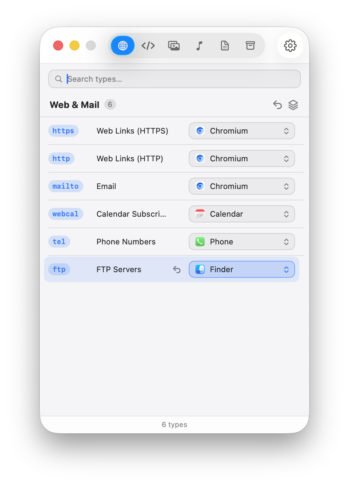

<div align="center">


# ExtSelector

See which app opens each file type on your Mac, and change it.

</div>

macOS hides the "open this kind of file with…" setting behind Get Info on a
single file. There is no one place to see every default at once, or to fix a
batch of them after some installer grabbed types you did not want it to. That is
what this app is for. File types are grouped into categories, you can search
them, and you can set one default or set them all at once.

It is a plain Swift Package. No Xcode project, no third-party dependencies, and
it targets macOS 26.

<div align="center">



</div>

## Install

```sh
brew install --cask skyline69/tap/ext-selector
```

The app is not signed with an Apple Developer ID, so the first launch gets
stopped by Gatekeeper. Right-click ExtSelector in Applications and choose
**Open**, then confirm. If you would rather do it from the terminal:

```sh
xattr -dr com.apple.quarantine "/Applications/ExtSelector.app"
```

Changing system default handlers needs full access, so the app is not sandboxed.

## Build from source

```sh
swift build            # debug
swift test             # run the catalog tests
./bundle.sh            # release build wrapped into ExtSelector.app
open ExtSelector.app
```

`bundle.sh` exists because a bare SPM executable launches as an accessory
process with no Dock icon and a window that will not focus. The script copies the
binary and resources into a hand-written `.app`, writes the `Info.plist`, and
builds the icon from `Resources/AppIcon.svg` (it falls back to the committed
`AppIcon.icns` if `librsvg` is missing).

## How it works

The data flows in one direction: `Catalog.json` → catalog model → SwiftUI views
→ a caching `HandlerStore` → Launch Services.

- **`Resources/Catalog.json`** is the curated list of file types in five
  categories. Editing the app's content means editing this file.
- **`LaunchServicesManager`** wraps Launch Services. It can set a default with
  the modern `NSWorkspace` API (which triggers the system "Use X / Keep Y"
  prompt) or silently for the bulk "set all" case, where one prompt per type
  would be unusable.
- **`HandlerStore`** is an actor that caches lookups so revisiting a category is
  instant, and invalidates after a change or when the app regains focus, since
  another app may have changed a default in the meantime.
